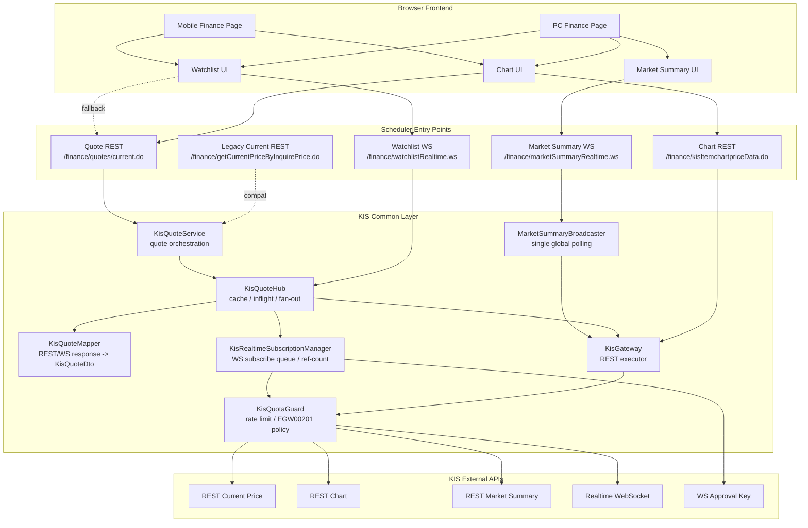
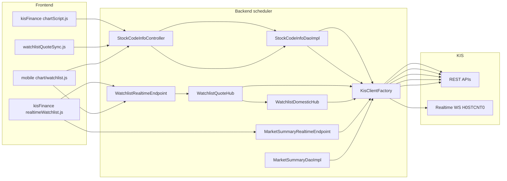
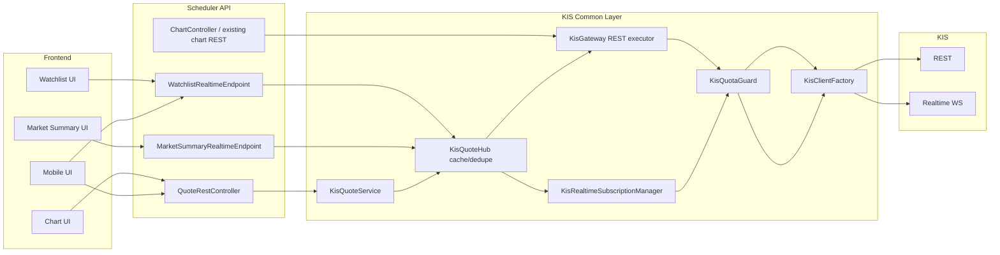
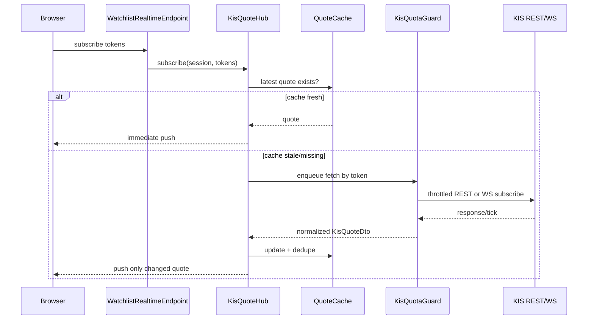

# KIS WebSocket/REST 호출 공통화 리팩토링 검토 설계

작성일: 2026-05-13

## 1. 검토 목적

KIS REST, KIS 실시간 WebSocket 호출 로직을 frontend/backend 관점에서 확인하고, 공통 계층을 만들어 호출하되 병목, 거래건수 초과, 무한 재연결, 중복 구독, 화면별 등락률 불일치가 발생하지 않도록 리팩토링 방향을 설계한다.

이번 설계는 즉시 대규모 코드를 교체하기보다, 현재 안정 장치를 보존하면서 호출 생성, 응답 표준화, 캐시/쿼터 제어, 브라우저 연결 관리를 단계적으로 분리하는 것을 목표로 한다.

## 2. 현재 호출 구조 요약

### 2-1. Frontend

프론트는 KIS에 직접 연결하지 않는다. 모두 scheduler 서버의 REST 또는 WebSocket endpoint로 진입한다.

| 화면/스크립트 | 호출 방식 | 서버 진입점 | 용도 |
| --- | --- | --- | --- |
| `kisFinance/js/realtimeWatchlist.js` | Browser WebSocket | `/finance/watchlistRealtime.ws` | 관심종목 실시간/폴링 현재가 수신 |
| `kisFinance/js/realtimeWatchlist.js` | Browser WebSocket | `/finance/marketSummaryRealtime.ws` | 상단 시장요약 지수 수신 |
| `kisFinance/js/chartScript.js` | Ajax REST | `/finance/kisItemchartpriceData.do` | 차트 일/주/月/년/분봉 조회 |
| `kisFinance/js/chartScript.js` | Ajax REST | `/finance/getCurrentPriceByInquirePrice.do` | 차트 현재가/현재가 라인 보강 |
| `kisFinance/js/watchlistQuoteSync.js` | Ajax REST | `/finance/getCurrentPriceByInquirePrice.do` | 관심종목 row 초기 현재가 보정 |
| `mobile/js/watchlist.js` | Browser WebSocket | `/finance/watchlistRealtime.ws` | 모바일 관심종목 현재가 수신 |
| `mobile/js/chart.js` | Fetch REST | `/finance/kisItemchartpriceData.do`, `/finance/getCurrentPriceByInquirePrice.do` | 모바일 차트/현재가 |

비활성 또는 중복 후보:

- `kisFinance/js/watchlistRealtime.js`
- `kisFinance/js/marketSummaryRealtime.js`

`kisFinance.jsp` 기준 활성 진입점은 `realtimeWatchlist.js`다. 위 두 파일은 과거/대체 구현으로 보이며, 공통화 전 실제 로딩 여부를 기준으로 정리 대상에 넣는다.

### 2-2. Backend

| 영역 | 파일 | KIS 호출 |
| --- | --- | --- |
| 공통 클라이언트 | `finance/kis/config/KisClientFactory.java` | `KisClient` singleton 생성 |
| REST 현재가 | `StockCodeInfoDaoImpl.getCurrentPriceByInquirePrice` | 국내 `InquirePriceApi` |
| 차트 | `StockCodeInfoDaoImpl.getInquireDailyItemchartprice` 등 | 국내/해외 일봉, 분봉, 지수 API |
| 관심종목 push | `WatchlistRealtimeEndpoint` -> `WatchlistQuoteHub` | 국내 실시간 또는 REST 폴링, 해외 REST 폴링 |
| 국내 실시간 | `WatchlistDomesticHub` | `H0STCNT0Api` 구독 |
| 시장요약 push | `MarketSummaryRealtimeEndpoint` | 국내 지수 REST, 해외 지수/환율 REST |
| 시장요약 REST | `MarketSummaryDaoImpl.selectMarketSummary` | 시장요약 REST 조회 |
| 추천/배치 수집 | `stock/service/KisDlyPriceSyncService` | 일봉/현재가 fetch |

이미 있는 안정 장치:

- `RateLimitingMiddleware`가 HTTP 요청 단위로 초당 REST limit을 대기 처리한다.
- `JavaHttpClient`가 KIS rate limit 응답을 감지해 backoff 후 재시도한다.
- `WatchlistQuoteHub`는 관심종목 REST 폴링을 `max.tokens.per.cycle`, `fetch.pool.size`, timeout으로 제한한다.
- `WatchlistDomesticHub`는 국내 실시간 구독을 session/code ref-count로 관리한다.
- `realtimeWatchlist.js`는 브라우저 WebSocket 재연결 backoff, stable key, 중복 연결 방어가 들어 있다.

취약점:

- 현재가 응답 변환이 `WatchlistQuoteHub`, `WatchlistDomesticHub`, `MarketSummaryDaoImpl`, `MarketSummaryRealtimeEndpoint`, `StockCodeInfoDaoImpl`, 프론트 JS에 흩어져 있다.
- `MarketSummaryRealtimeEndpoint`는 세션마다 5초 주기로 같은 KIS 시장요약 REST를 반복 조회한다. 접속 브라우저가 늘면 요청 수가 선형 증가한다.
- `watchlistQuoteSync.js`가 관심종목 row마다 `/getCurrentPriceByInquirePrice.do`를 별도로 호출한다. WebSocket이 정상이라면 중복 REST가 된다.
- 차트 헤더는 차트 직전봉 기준, 관심종목은 KIS 현재가 API 기준으로 등락률 기준이 달라질 수 있다.

## 3. 목표 구조

공통화는 3계층으로 나눈다.

1. `KisGateway`: KIS REST/실시간 API 요청 생성과 실행을 담당한다.
2. `KisQuoteService`: 현재가/지수/환율 응답을 화면 표준 Quote DTO로 변환한다.
3. `KisQuoteHub`: REST polling, 실시간 tick, cache, dedupe, browser broadcast를 관리한다.

차트 일봉/분봉은 데이터 양과 사용 목적이 다르므로 1차 공통화 대상에서 제외한다. 단, 현재가/등락률 표준 DTO는 차트 헤더에도 사용한다.

### 3-1. 표준 DTO

```java
public class KisQuoteDto {
    private String type;       // QUOTE, SUMMARY
    private String token;      // KR|KRX|005930
    private String country;    // KR, US
    private String market;     // KRX, NAS, NYS, ...
    private String code;
    private String price;
    private String diff;
    private String rate;
    private String sign;       // +, -, 0 로 정규화
    private String basePrice;  // 가능하면 current - diff 또는 API 기준가
    private String source;     // REST_CURRENT, WS_TICK, REST_INDEX, REST_OVERSEAS
    private long fetchedAt;
    private boolean stale;
}
```

핵심 규칙:

- 화면은 `rate`를 재계산하지 않고 서버 표준 DTO를 우선 사용한다.
- 숫자 부호는 서버에서 `+, -, 0`로 정규화한다.
- `basePrice`를 포함해 차트와 관심종목 기준가 차이를 추적 가능하게 한다.
- KIS 원 응답이 필요한 기존 API는 당장 깨지지 않도록 `singleData.raw` 또는 별도 필드로 호환 제공한다.

## 4. 설계 다이어그램

### 4-0. 전체 목표 로직



핵심은 화면이 KIS를 직접 보지 않고, scheduler 내부의 공통 계층이 `호출량 제어`, `캐시`, `응답 표준화`, `브라우저 fan-out`을 책임지는 구조다.

### 4-1. 현재 구조



문제는 `F`, `H`, `I`, `J`, `K`, 프론트에서 각자 Quote 변환을 한다는 점이다.

### 4-2. 목표 구조



### 4-3. 병목 방어 흐름



## 5. 병목/거래건수 초과 방어 전략

### 5-1. REST 요청

정책:

- 모든 REST 호출은 `KisGateway.executeRest()`를 통과시킨다.
- `RateLimitingMiddleware`는 유지하되, 업무 레벨 큐를 추가해 “대기 중 요청 폭증”을 막는다.
- 동일 key 요청은 inflight coalescing 한다. 예: `CURRENT|KR|KRX|012330`이 이미 조회 중이면 새 KIS 호출을 만들지 않고 같은 Future를 공유한다.
- TTL 캐시를 둔다.
  - 현재가 REST: 장중 700~1500ms
  - 시장요약: 3000~5000ms
  - 차트 일봉/분봉: 요청 파라미터 기준 10~60초 또는 화면 요청 단위 캐시
- `force=true`는 관리자/수동 갱신에만 허용한다.

권장 설정:

- `kis.rest.limit.per.second=20` 기준 내부 hard limit은 70~80%인 14~16 rps로 운용
- 관심종목 REST fallback은 현재처럼 `max.tokens.per.cycle=4`, `period.ms=1000` 유지 또는 시장요약과 통합 큐에서 전체 rps 조절
- 429/초과 응답 시 1차 backoff는 `JavaHttpClient`, 2차 업무 큐는 해당 key를 short-circuit stale cache로 반환

### 5-2. 실시간 WebSocket 구독

정책:

- KIS 실시간 구독/해제는 `KisRealtimeSubscriptionManager` 한 곳에서만 수행한다.
- `code -> upstream subscription`은 하나만 유지하고, 브라우저 session은 ref-count set으로 붙인다.
- reconnect 시 기존 upstream subscription 상태를 확인한 뒤 재등록한다.
- 구독 실패 시 즉시 반복하지 않고 code별 cooldown을 둔다.
- 구독 가능 수 제한은 설정값으로 둔다. 초과 시 실시간 구독 대신 REST polling fallback으로 전환한다.

권장 설정:

- `kis.socket.limit.per.second=10` 기준 subscribe/unsubscribe는 초당 5~7 이하로 제한
- 신규 관심종목 대량 로딩 시 batch subscribe queue 사용
- 같은 session에서 같은 token 재구독은 무시
- KIS 샘플 기준 실시간 구독은 최대 40개 제한을 별도 설정으로 둔다. 단, 브라우저 세션 수가 아니라 KIS upstream 기준 unique subscription key 수로 계산한다.
- subscribe/unsubscribe 전송 간격은 최소 100ms 이상으로 둔다. 모의투자 환경은 더 보수적인 간격을 설정할 수 있게 한다.
- PINGPONG 응답은 업무 endpoint가 아니라 KIS socket client/manager 계층에서 처리한다.

### 5-3. Market Summary

현재 가장 큰 병목 후보는 `MarketSummaryRealtimeEndpoint`다. 세션마다 5초마다 KIS REST 5개 이상을 호출할 수 있다.

개선안:

- 세션별 polling 제거
- 서버 전역 `MarketSummaryBroadcaster` 1개만 5초 주기로 조회
- 결과를 cache에 저장하고 모든 session에 broadcast
- 신규 session은 cache 즉시 전송 후 broadcaster session set에 등록

효과:

- 브라우저 10개 접속 시 기존 최대 `10 * 5개 / 5초 = 10 rps` 수준까지 증가
- 개선 후 `1 * 5개 / 5초 = 1 rps` 수준으로 고정

### 5-4. Watchlist 초기 REST 보정

`watchlistQuoteSync.js`는 row MutationObserver 기반으로 현재가 REST를 직접 호출한다. WebSocket/Hub가 정상 동작하면 중복이다.

개선안:

- 관심종목 초기값은 `WatchlistRealtimeEndpoint` 구독 직후 hub cache를 즉시 push한다.
- `watchlistQuoteSync.js`는 fallback 전용으로 전환한다.
  - WS 연결 실패 또는 3초 이상 첫 quote 미수신 시에만 REST fallback 호출
  - row별 호출 대신 `/finance/quotes/current.do?tokens=...` bulk endpoint 사용

## 6. 리팩토링 단계

### Phase 1. 표준 Quote DTO와 변환 공통화

수정 범위:

- 신규 `com.scheduler.finance.kis.quote.KisQuoteDto`
- 신규 `KisQuoteMapper`
  - `fromDomesticRest(InquirePriceResult)`
  - `fromDomesticTick(H0STCNT0Data)`
  - `fromOverseasRest(PriceResult)`
  - `fromDomesticIndex(InquireIndexPriceResult)`
  - `fromOverseasIndex(InquireOverseasDailyChartPriceResult)`
- `WatchlistQuoteHub`, `WatchlistDomesticHub`에서 DTO 변환만 교체

위험도: 낮음

이유:

- KIS 호출 방식과 endpoint lifecycle은 그대로 둔다.
- 화면 payload 필드명도 기존 `price/diff/rate/sign`을 유지한다.

### Phase 2. 현재가 REST 공통 endpoint 정리

수정 범위:

- 신규 또는 기존 controller에 `/finance/quotes/current.do`
- 기존 `/finance/getCurrentPriceByInquirePrice.do`는 호환 유지
- `chartScript.js`, `watchlistQuoteSync.js`, 모바일 chart가 표준 DTO를 우선 읽도록 보강

위험도: 중간

주의:

- 기존 응답 `singleData.output` 의존 코드가 있어 호환 wrapper를 유지한다.
- 화면 전환 중 캐시가 오래된 값을 보여주지 않도록 `fetchedAt/stale`을 내려준다.

### Phase 3. QuoteHub 캐시/중복 요청 통합

수정 범위:

- 신규 `KisQuoteHub` 또는 기존 `WatchlistQuoteHub` 내부 구조 분리
- current quote cache, inflight map, bulk fetch queue
- `watchlistQuoteSync.js`를 fallback only로 변경

위험도: 중간

주의:

- 동시성 테스트 필요
- session close 시 구독 해제/캐시 유지 정책 분리 필요

### Phase 4. MarketSummary 전역 broadcaster 전환

수정 범위:

- `MarketSummaryRealtimeEndpoint`
- 신규 `MarketSummaryBroadcaster`
- 기존 `MarketSummaryDaoImpl.selectMarketSummary`와 변환 함수 공유

위험도: 중간 이상

주의:

- 시장요약 UI는 항상 떠 있으므로 장애 시 사용자 체감이 크다.
- 먼저 REST 캐시 계층을 넣고, 그 다음 broadcaster를 분리하는 순서가 안전하다.

### Phase 5. 차트 데이터 gateway 분리

수정 범위:

- `StockCodeInfoDaoImpl`의 일봉/분봉/해외/지수 KIS 호출부 일부 이동
- `KisChartService`, `KisChartMapper`

위험도: 높음

주의:

- 차트는 국내/해외/지수/분봉/기간 검증/fallback이 복잡하다.
- 현재가 불일치 해결과 직접 관련이 낮으므로 마지막 단계로 둔다.

## 7. 오류 가능성 평가

| 리팩토링 범위 | 오류 가능성 | 이유 |
| --- | --- | --- |
| DTO 변환 공통화만 | 낮음 | 호출 lifecycle 보존, payload 필드 유지 |
| 현재가 REST 표준화 | 중간 | 프론트 응답 파싱 영향 |
| watchlist cache/inflight 통합 | 중간 | 동시성, session close, stale 처리 필요 |
| market summary broadcaster 전환 | 중간 이상 | 세션별 task 제거로 lifecycle 변경 |
| 차트 전체 gateway 분리 | 높음 | StockCodeInfoDaoImpl에 분기/fallback이 많음 |

## 8. 검증 체크리스트

1. 관심종목: 국내 실시간 on/off 양쪽 모두 정상 수신
2. 관심종목: 같은 종목을 여러 브라우저가 봐도 KIS upstream 구독은 1개
3. 관심종목: 해외 종목은 REST polling fallback으로 정상 수신
4. 차트 헤더: 현재가, 등락폭, 등락률이 관심종목과 동일 기준으로 표시
5. 시장요약: 브라우저 N개 접속 시 KIS 요청 수가 N배 증가하지 않음
6. KIS 429/거래건수 초과 응답 시 backoff 후 stale cache 또는 사용자 경고로 degrade
7. WebSocket close/reconnect 반복 시 subscribe/unsubscribe 폭주 없음
8. 화면 이탈 시 browser WS close, 서버 session cleanup 정상

## 9. open-trading-api 샘플 추가 검토

추가 검토 대상:

- `/Users/jinhyun/projects/open-trading-api-main/examples_user/kis_auth.py`
- `/Users/jinhyun/projects/open-trading-api-main/examples_user/domestic_stock/domestic_stock_functions.py`
- `/Users/jinhyun/projects/open-trading-api-main/examples_user/domestic_stock/domestic_stock_functions_ws.py`
- `/Users/jinhyun/projects/open-trading-api-main/backtester/kis_backtest/providers/kis/websocket.py`
- `/Users/jinhyun/projects/open-trading-api-main/backtester/kis_backtest/providers/kis/data.py`
- `/Users/jinhyun/projects/open-trading-api-main/backtester/kis_backtest/providers/kis/auth.py`
- `/Users/jinhyun/projects/open-trading-api-main/README.md`

### 9-1. 샘플에서 확인한 공통화 패턴

샘플도 REST와 WebSocket을 하나의 거대한 호출 함수로 합치지 않는다. 대신 아래처럼 경계를 나눈다.

| 영역 | 샘플 패턴 | scheduler 반영 방향 |
| --- | --- | --- |
| REST 인증/헤더/호출 | `kis_auth._url_fetch()`가 base url, header, `tr_id`, `tr_cont`를 공통 처리 | `KisGateway.executeRest()`로 요청 생성/실행/응답 오류를 공통화 |
| REST 호출 간격 | `smart_sleep()`를 모든 연속/페이징 호출 사이에 삽입 | `KisQuotaGuard`와 업무 큐에서 API별 최소 간격 보장 |
| WS 승인키 | REST token과 별도로 `/oauth2/Approval` 승인키 발급 | REST token cache와 WS approval key cache를 분리 |
| WS 구독 메시지 | `data_fetch()` 또는 `_create_subscribe_message()`에서 TR별 구독 메시지 생성 | `KisRealtimeSubscriptionManager`에서 TR key별 subscribe/unsubscribe 생성 |
| WS 수신 처리 | data frame, system message, PINGPONG을 socket 계층에서 분리 | PINGPONG, 암호화 key, reconnect 처리를 KIS socket client 내부로 격리 |
| 응답 DTO | backtester는 `RealtimePrice` dataclass로 표준화 | `KisQuoteDto`에 공통 필드와 확장 필드를 둔다 |

### 9-2. 샘플 기반으로 보강해야 할 위험 방어

1. WebSocket 구독 제한

   샘플은 구독 수 40개 초과를 오류로 본다. scheduler는 브라우저별 구독 수가 아니라 `TR_ID|market|code` 같은 upstream unique key 기준으로 40개 제한을 적용해야 한다. 초과 시 낮은 우선순위 종목은 REST polling fallback으로 전환한다.

2. WebSocket subscribe 속도 제한

   샘플은 구독 메시지를 보낸 뒤 짧은 sleep을 둔다. scheduler도 `kis.socket.limit.per.second=10`만 믿지 말고 subscribe/unsubscribe queue에 최소 전송 간격을 둔다.

   권장 추가 설정:

   ```properties
   kis.ws.max.subscriptions=40
   kis.ws.subscribe.min.interval.ms=100
   kis.ws.unsubscribe.min.interval.ms=100
   kis.ws.max.reconnect.retries=5
   kis.ws.reconnect.base.delay.ms=2000
   ```

3. REST 초과 응답 `EGW00201`

   샘플 backtester는 `EGW00201` 발생 시 61초 대기 후 최대 3회 재시도한다. scheduler는 이미 `JavaHttpClient`와 `RateLimitingMiddleware`가 있지만, 업무 유형별 정책을 분리하는 것이 안전하다.

   - 화면 현재가/시장요약: 긴 대기 대신 stale cache 반환, 다음 cycle에서 재시도
   - 배치/히스토리/차트 대량 조회: 61초 대기 후 제한 횟수 재시도
   - 반복 실패: 사용자 화면에는 “지연” 상태를 표시하고 서버 로그에는 key, TR_ID, retry count만 기록

4. REST 페이징/연속조회

   샘플은 `tr_cont` 연속조회 사이에 `smart_sleep()`를 넣고, 재귀 깊이 또는 최대 반복 수를 둔다. scheduler 차트 조회는 날짜 window loop가 많으므로 gateway 분리 시 다음 규칙을 공통화한다.

   - page/window별 최소 sleep
   - 최대 page/window 수
   - 연속조회 key별 inflight dedupe 금지. 연속조회는 순서가 의미 있으므로 current quote처럼 Future 공유하면 안 된다.

5. 실시간 DTO 확장성

   샘플 `RealtimePrice`는 현재가, 등락, 등락률뿐 아니라 시가/고가/저가/거래량/호가/시간까지 갖는다. scheduler의 1차 DTO는 기존 화면 호환을 위해 `price/diff/rate/sign` 중심으로 두되, 아래 확장 필드는 optional로 열어둔다.

   ```java
   private String open;
   private String high;
   private String low;
   private String volume;
   private String totalVolume;
   private String askPrice;
   private String bidPrice;
   private String tradeTime;
   ```

6. 등락 부호 표준

   샘플 `RealtimePrice.change_sign` 주석은 KIS 부호코드를 `1:상한, 2:상승, 3:보합, 4:하한, 5:하락`으로 보존한다. scheduler 공통 mapper도 이 기준을 따라야 한다.

   표준 규칙:

   - `1`, `2` → 상승 `+`
   - `3` → 보합 `0`
   - `4`, `5` → 하락 `-`
   - `diff/rate`가 양수 문자열로 내려와도 `sign=4/5`이면 화면 표준 DTO에서는 음수로 정규화
   - 방향 판단 우선순위는 `sign -> diff -> rate`

   ```mermaid
   flowchart LR
       A["KIS raw<br/>price, diff, rate, sign"] --> B["KisQuoteMapper"]
       B --> C{"sign"}
       C -->|"1/2"| D["direction=up<br/>diff/rate +"]
       C -->|"3"| E["direction=flat<br/>diff/rate 0"]
       C -->|"4/5"| F["direction=down<br/>diff/rate -"]
       C -->|"empty"| G["fallback by diff/rate"]
       D --> H["KisQuoteDto"]
       E --> H
       F --> H
       G --> H
   ```

7. 환경별 호출 간격

   샘플은 실전과 모의투자의 sleep 값을 다르게 둔다. scheduler도 같은 `kis.rest.limit.per.second`만 쓰기보다 실전/모의별 최소 간격을 분리한다.

   ```properties
   kis.rest.real.min.interval.ms=50
   kis.rest.paper.min.interval.ms=500
   ```

8. 인증/로그 보안

   샘플 wrapper는 인증 실패 메시지를 정리해서 던진다. scheduler도 gateway 단계에서 appkey, appsecret, token, approval key는 로그에 남기지 않도록 마스킹한다.

### 9-3. 샘플 검토 후 설계 조정 결론

샘플 검토 후에도 기존 권장 순서는 유지한다. 다만 Phase 3 이전에 `KisQuotaGuard`와 `KisRealtimeSubscriptionManager`의 설정값을 먼저 명확히 잡아야 한다.

보강된 우선순위:

1. `KisQuoteDto`, `KisQuoteMapper`로 등락률/등락가격 기준 통일
2. `KisGateway`에 REST 호출 간격, `EGW00201` 정책, 로그 마스킹 추가
3. `KisRealtimeSubscriptionManager`에 upstream unique 구독 제한 40개, subscribe queue, PINGPONG 처리 추가
4. `WatchlistQuoteHub` cache/inflight/bulk fallback 적용
5. `MarketSummaryBroadcaster` 전역화

샘플은 단일 프로세스 예제/백테스터 성격이라 다중 브라우저 접속에 따른 서버 측 fan-out 문제는 직접 다루지 않는다. 따라서 scheduler에서는 기존 설계의 `MarketSummaryBroadcaster` 전환이 여전히 가장 중요한 병목 개선 포인트다.

## 10. 권장 결론

권장 순서는 `Phase 1 -> Phase 2 -> Phase 3 -> Phase 4`다.

가장 먼저 해야 할 일은 KIS 호출을 한 번에 전부 바꾸는 것이 아니라, 현재가/등락률 표준 DTO를 만든 뒤 `REST 현재가`, `관심종목 REST polling`, `국내 실시간 tick`이 같은 변환 함수를 쓰게 하는 것이다.

이렇게 하면 현대모비스 사례처럼 같은 현재가인데 등락폭/등락률 기준이 갈라지는 문제를 먼저 줄일 수 있고, 이후 cache/inflight/broadcaster를 붙여도 화면 payload 계약이 흔들리지 않는다.

## 11. 1차 구현 반영 내역

반영일: 2026-05-13

### 11-1. Backend

- 신규 `KisQuoteDto`
- 신규 `KisQuoteMapper`
- 신규 `KisQuoteResponse`
- 신규 `KisQuoteService`
- 신규 endpoint `/finance/quotes/current.do`
- 기존 endpoint `/finance/getCurrentPriceByInquirePrice.do`는 원 KIS 응답 호환 유지
- `WatchlistQuoteHub` REST polling payload를 `KisQuoteService`/`KisQuoteMapper` 기준으로 변경
- `WatchlistDomesticHub` 국내 실시간 tick payload를 `KisQuoteMapper.fromDomesticTick()` 기준으로 변경
- `WatchlistDomesticHub`에 upstream 구독 제한과 subscribe 전송 간격 추가
  - `kis.ws.max.subscriptions=40`
  - `kis.ws.subscribe.min.interval.ms=100`
- `MarketSummaryRealtimeEndpoint`를 세션별 polling에서 전역 polling + 세션 fan-out 구조로 변경

### 11-2. Frontend

- `chartScript.js` 현재가 조회 endpoint를 `/finance/quotes/current.do`로 변경
- 차트 헤더 등락폭/등락률은 `quote.diff`, `quote.rate`, `quote.basePrice`를 우선 사용
- `watchlistQuoteSync.js` REST fallback도 `/finance/quotes/current.do`를 사용하고 `quote` payload를 우선 파싱

### 11-3. 검증

- 변경 Java 파일 대상 임시 컴파일 통과
- `chartScript.js` Node syntax check 통과
- `watchlistQuoteSync.js` Node syntax check 통과

### 11-4. 2차 반영 내역 (2026-05-13 추가 보강)

설계 2/3절의 불일치/오류 및 권장 보강을 반영.

Backend:

- `KisQuoteService.validateRestResult`: 빈 `rtCd`도 비정상으로 처리 (정상 = "0"만 허용)
- `/finance/quotes/current.do`에 `in_country`, `in_market`(EXCD) 분기 추가 → 해외 종목 표준 quote 응답
- `KisQuoteMapper`에 `fromDomesticIndex`, `fromOverseasIndex` 추가
- `MarketSummaryRealtimeEndpoint.fetchDomesticIndex` / `fetchOverseasOne`이 위 mapper 사용 → 등락 기준 통일
- `WatchlistDomesticHub.unsubscribeOne`에 `throttleUnsubscribeSend()` 적용
- `KisProperties`에 `kis.ws.unsubscribe.min.interval.ms` (기본 100) 추가
- `WatchlistQuoteHub`에 token 단위 inflight coalescing + TTL 1000ms 캐시 추가 (`fetchQuoteCached`)

Frontend:

- `realtimeWatchlist.js`가 WL tick 수신 시 `window.__watchlistWsLastTickByCode[code] = Date.now()` 기록
- `watchlistQuoteSync.js`는 최근 3초 이내 WS tick이 있으면 REST fallback 생략 → 중복 REST 제거

### 11-5. 미구현 (다이어그램 대비 갭)

설계 4-0/4-2 다이어그램의 다음 컴포넌트는 아직 별도 클래스로 분리되지 않음. 현재는 기존 `JavaHttpClient` / `RateLimitingMiddleware` / `KisQuoteService` 가 역할 일부를 대신함.

- `KisGateway` (REST executor 분리) — 미구현
- `KisQuotaGuard` (업무 유형별 rate / EGW00201 정책) — 미구현, JavaHttpClient backoff에 의존
- `KisRealtimeSubscriptionManager` (upstream unique 구독 + queue) — 미구현, `WatchlistDomesticHub` 내부에서 처리
- `KisQuoteHub` 독립 클래스 — 미구현, `WatchlistQuoteHub`에 cache/inflight만 추가
- Bulk 현재가 endpoint (`/finance/quotes/current.do?tokens=...`) — 미구현
- 차트 mapper / `KisChartService` (Phase 5) — 미구현
- 모바일/패턴/recPickManage 화면의 legacy endpoint 전환 — 미반영

### 11-6. 3차 반영 내역 (2026-05-14 샘플 검증 후 보강)

`/Users/jinhyun/projects/open-trading-api-main` 샘플과 비교해 등락 부호 표준을 보강.

Backend:

- `KisQuoteMapper.normalizeSign`에서 `sign=3`을 상승이 아니라 보합 `0`으로 수정
- 국내 REST, 국내 WS tick, 해외 REST, 국내 지수, 해외 지수 mapper에서 `sign` 기준으로 `diff/rate`를 signed 값으로 정규화
- 하락 코드 `4/5`이면 KIS 원 응답의 `diff/rate`가 양수 문자열이어도 `-diff`, `-rate`로 표준화
- 상승 코드 `1/2`이면 `+diff`, `+rate`로 표준화
- 보합 코드 `3`이면 `diff/rate`를 `0` 방향으로 표준화

Frontend:

- `realtimeWatchlist.js`의 방향 판단을 `diff/rate 우선`에서 `sign 우선`으로 변경
- `watchlistQuoteSync.js` REST fallback도 `sign`을 먼저 보고 색상 방향과 `diff` 부호를 보정

검증:

- `KisQuoteDto`, `KisQuoteMapper` 임시 컴파일 통과
- `realtimeWatchlist.js` Node syntax check 통과
- `watchlistQuoteSync.js` Node syntax check 통과

주의:

- `sign`이 없는 legacy 데이터는 기존처럼 `diff -> rate` 순서로 fallback한다.
- 관심종목 row border animation은 전일대비 방향이 아니라 직전 tick 대비 가격 움직임이므로 공통 등락 방향과 분리해서 유지한다.
