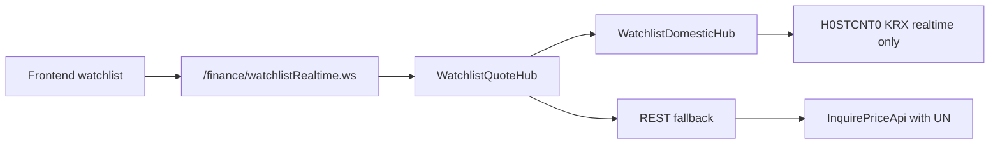
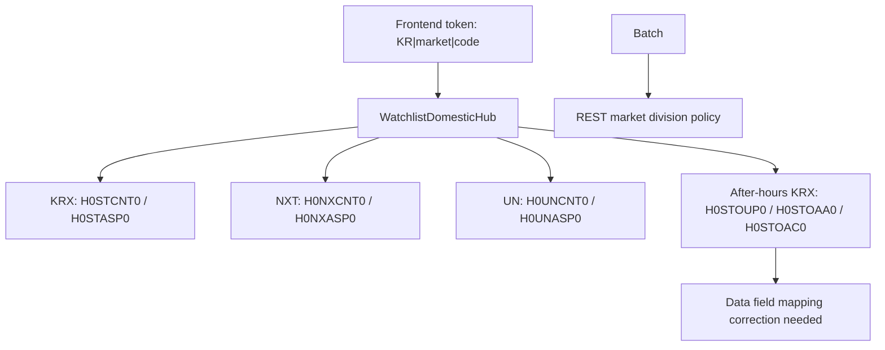
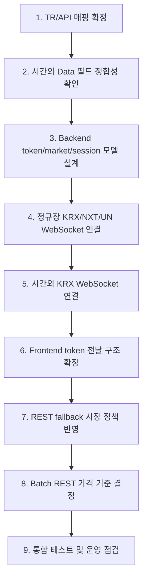

# KRX/NXT 실시간 및 시간외 WebSocket 적용 작업 계획서

작성일: 2026-05-14

## 1. 목적

`open-trading-api-main` 샘플 소스와 scheduler 프로젝트 소스를 비교하여 국내 주식 KRX/NXT 정규장 실시간 호출 가능 여부, 정규장 이후 시간외 WebSocket 데이터 수신 가능 여부, REST 호출 영향 범위, frontend/backend/batch 적용 범위를 정리하고 단계별 작업 계획을 수립한다.

이번 문서는 분석 및 계획서이며, 작성 시점 기준 소스 로직은 변경하지 않았다.

## 2. 현재 상태 요약

| 영역 | 현재 상태 | 판단 |
| --- | --- | --- |
| WebSocket 공통 클라이언트 | `JsrSocketClient` 구현 완료 | TR ID/TR Key 기반 구독 구조 사용 가능 |
| KRX 정규장 실시간 | `H0STCNT0`, `H0STASP0` API 클래스 존재 | 관심종목 체결가에서 일부 사용 중 |
| NXT 정규장 실시간 | `H0NXCNT0`, `H0NXASP0` API 클래스 존재 | 현재 화면 허브 로직에는 미연결 |
| 통합 시세 실시간 | `H0UNCNT0`, `H0UNASP0` API 클래스 존재 | 현재 화면 허브 로직에는 미연결 |
| 시간외 KRX 실시간 | `H0STOUP0`, `H0STOAA0`, `H0STOAC0` API 클래스 존재 | Data 필드 정합성 확인 및 수정 필요 |
| REST 현재가 | Watchlist fallback은 `UN` 사용 | 일부 반영됨 |
| Batch REST | 일봉/현재가 REST 기반 | 시장 구분 정책 정의 필요 |
| Frontend | 국내 기본값 KRX 중심 | NXT/UN/시간외 선택 정보 전달 구조 필요 |
| 실전/모의 환경 | `kis.env`, `kis.http.host`, `kis.socket.host` 설정 기반 | 샘플의 `env_dv`와 매핑 정책 확인 필요 |

## 3. 샘플 소스 기준 TR 매핑

| 구분 | TR ID | 설명 |
| --- | --- | --- |
| KRX 정규장 호가 | `H0STASP0` | 국내 주식 KRX 실시간 호가 |
| NXT 정규장 호가 | `H0NXASP0` | 국내 주식 NXT 실시간 호가 |
| 통합 정규장 호가 | `H0UNASP0` | 국내 주식 통합 실시간 호가 |
| KRX 정규장 체결 | `H0STCNT0` | 국내 주식 KRX 실시간 체결 |
| NXT 정규장 체결 | `H0NXCNT0` | 국내 주식 NXT 실시간 체결 |
| 통합 정규장 체결 | `H0UNCNT0` | 국내 주식 통합 실시간 체결 |
| KRX 시간외 호가 | `H0STOAA0` | 장후 시간외 단일가 호가 |
| KRX 시간외 체결 | `H0STOUP0` | 장후 시간외 단일가 체결 |
| KRX 시간외 예상체결 | `H0STOAC0` | 장후 시간외 예상체결 |

REST `FID_COND_MRKT_DIV_CODE`는 내부 market 명칭과 KIS API 코드가 다르므로 별도 매핑이 필요하다.

| 내부 market | KIS REST 코드 | 설명 |
| --- | --- | --- |
| `KRX` | `J` | KRX |
| `NXT` | `NX` | NXT |
| `UN` | `UN` | 통합 |
| `ELW` | `W` | ELW |

## 4. 현재 프로젝트 호출 구조

### 4-1. WebSocket

- `WatchlistRealtimeEndpoint`가 브라우저 WebSocket 진입점이다.
- `WatchlistQuoteHub`가 국내/해외 token을 분리하고 국내 실시간 사용 여부를 판단한다.
- 국내 실시간은 `WatchlistDomesticHub`로 위임된다.
- 현재 `WatchlistDomesticHub`는 국내 종목에 대해 `H0STCNT0Api`만 구독한다.
- 따라서 현재 운영 경로 기준으로는 KRX 정규장 체결가만 WebSocket으로 사용 중이다.

### 4-2. REST

- `KisQuoteService.getDomesticCurrentRaw`는 REST 현재가 조회 시 `FID_COND_MRKT_DIV_CODE = "UN"`을 사용한다.
- Watchlist WebSocket 실패 또는 미사용 시 REST fallback은 통합 시세 기준으로 동작할 수 있다.
- Batch의 `KisDlyPriceSyncService` 현재가 보정 경로는 별도 정책 확인이 필요하다.

### 4-3. Batch

- Batch는 WebSocket을 직접 사용하지 않는다.
- 추천 신호 계산과 일봉 동기화는 REST 일봉/현재가 기반이다.
- NXT/UN 적용 시 Batch에는 WebSocket보다는 REST 시장 구분 정책이 영향을 준다.

## 5. 주요 확인 결과

### 5-1. KRX/NXT 정규장 실시간

KRX/NXT 정규장 실시간은 프로젝트에 API 클래스가 이미 있으므로 호출 기반은 존재한다. 적용 작업의 핵심은 신규 WebSocket 클라이언트 개발이 아니라, 시장 구분에 따라 다음 API를 선택하도록 애플리케이션 계층을 확장하는 것이다.

| 시장 | 체결 TR | 호가 TR |
| --- | --- | --- |
| KRX | `H0STCNT0` | `H0STASP0` |
| NXT | `H0NXCNT0` | `H0NXASP0` |
| 통합 | `H0UNCNT0` | `H0UNASP0` |

### 5-2. 정규장 이후 시간외 WebSocket

샘플에는 KRX 시간외 WebSocket TR이 존재하며, 프로젝트에도 대응 API 클래스가 있다. 다만 시간외 Data 클래스가 샘플 필드 구조와 맞지 않는 것으로 확인되었다.

현재 `JsrSocketClient`는 WebSocket payload의 첫 번째 컬럼을 종목코드 `trKey`로 보고 구독자에게 dispatch한다. 시간외 Data 클래스가 JSON REST 응답 envelope처럼 `rtCd`, `msgCd`, `msg1`, `output1` 필드를 앞에 포함하면 payload field count가 맞지 않거나 첫 컬럼이 종목코드로 인식되지 않을 수 있다.

우선 확인 대상:

| 파일 | 확인 내용 |
| --- | --- |
| `H0STOUP0Data.java` | 시간외 체결 필드가 샘플 43개 컬럼과 일치하는지 확인 |
| `H0STOAA0Data.java` | 시간외 호가 필드가 샘플 54개 컬럼과 일치하는지 확인. 샘플은 9호가 구조이나 프로젝트는 envelope 4개와 10호가 4개가 추가된 62개 필드 구조이므로, `rtCd/msgCd/msg1/output1` 및 `askp10/bidp10/askpRsqn10/bidpRsqn10` 제거 또는 별도 payload class 분리가 필요 |
| `H0STOAC0Data.java` | 시간외 예상체결 필드가 샘플 43개 컬럼과 일치하는지 확인 |

### 5-3. 추가 검증 결과

계획서 보강 검토 과정에서 다음 항목을 추가 확인했다.

| 항목 | 검증 결과 | 계획 반영 |
| --- | --- | --- |
| `H0STOAA0Data` 필드 차이 | 샘플은 9호가 54컬럼, 프로젝트는 envelope 4개 + 10호가 구조 58컬럼으로 총 62개 | 시간외 Data 정합성 작업에 10호가 제거/분리 명시 |
| REST 시장코드 | `InquirePriceApi` 주석 기준 `J=KRX`, `NX=NXT`, `UN=통합` | 내부 market과 KIS API code 매핑표 추가 |
| 실전/모의 환경 | 샘플 WebSocket은 `env_dv=real/demo`를 받지만 TR ID는 동일, 프로젝트는 host 설정으로 분기 | 환경 정책 확인 항목 추가 |
| 숫자 타입 | 정규장 `H0STCNT0Data`는 가격/수량 다수 `Number`, 시간외 3종은 대부분 `String` | mapper/type 일관성 검토 추가 |
| 시간외 운영시간 | 샘플 주석상 시간외 단일가 16:00~18:00 데이터 확인 가능 | 검증 계획에 시간대 명시 |

## 6. 적용 범위

### 6-1. Backend

| 파일 | 작업 내용 |
| --- | --- |
| `WatchlistDomesticHub.java` | KRX 고정 구독을 시장/세션별 TR 선택 구조로 확장 |
| `WatchlistQuoteHub.java` | 국내 token에서 market/session 정보를 보존해 DomesticHub로 전달 |
| `KisQuoteMapper.java` | KRX/NXT/UN/시간외 Data별 mapper 추가 또는 공통화, `Number`/`String` 가격 타입 처리 기준 통일 |
| `H0STOUP0Data.java` | 시간외 체결 WebSocket payload 필드 정합성 보정 |
| `H0STOAA0Data.java` | 시간외 호가 WebSocket payload 필드 정합성 보정. 샘플 9호가 구조 기준으로 10호가 필드 처리 방침 결정 |
| `H0STOAC0Data.java` | 시간외 예상체결 WebSocket payload 필드 정합성 보정 |
| `KisProperties.java` / `KisClientFactory.java` | 샘플 `env_dv`와 프로젝트 `kis.env`, REST/WS host 설정의 매핑 정책 확인 |

### 6-2. REST

| 파일 | 작업 내용 |
| --- | --- |
| `KisQuoteService.java` | Watchlist REST fallback의 `UN` 정책 유지/명시화 |
| `KisDlyPriceSyncService.java` | Batch 현재가 보정 시 시장 구분 정책 검토 |
| 국내 REST API wrapper | `FID_COND_MRKT_DIV_CODE` 적용 가능 범위 확인, 내부 `KRX/NXT/UN/ELW` 값을 KIS `J/NX/UN/W`로 변환하는 공통 매핑 도입 검토 |

### 6-3. Frontend

| 파일 | 작업 내용 |
| --- | --- |
| `pattern.js` | 국내 종목 token 생성 시 market/session 전달 가능성 검토 |
| `kisFinancePage.js` | 국내 기본 market KRX 외 NXT/UN 선택 구조 검토 |
| `recPickManage.js` | 추천 종목 관리 화면 token 규칙 정합성 검토 |
| `watchlistRealtime.js` / `realtimeWatchlist.js` | 수신 market/session 표시 및 호환성 확인 |

### 6-4. Batch

| 파일 | 작업 내용 |
| --- | --- |
| `RecSignalService.java` | 현재가 보정값이 추천 신호에 미치는 영향 검토 |
| `KisDlyPriceSyncService.java` | 일봉/현재가 REST 호출의 국내 시장 기준 정의 |
| Batch 관리 화면/스케줄러 | NXT/UN 적용 여부가 설정값으로 필요한지 검토 |

## 7. 권장 작업 순서

| 단계 | 작업 | 산출물 |
| --- | --- | --- |
| 1 | TR/API 매핑 최종 확정 | TR 매핑표 |
| 2 | 시간외 Data 클래스와 샘플 payload 필드 비교 | 필드 정합성 검증표 |
| 3 | Backend token 모델 정의 | `country/market/session/code` 규칙 |
| 4 | `WatchlistDomesticHub` 시장별 구독 분기 설계 | Backend 설계안 |
| 5 | KRX/NXT/UN 정규장 WebSocket 연결 | 정규장 수신 검증 결과 |
| 6 | 시간외 KRX WebSocket 연결 | 시간외 수신 검증 결과 |
| 7 | Frontend token 전달 구조 확장 | 화면 영향 범위 및 수정안 |
| 8 | REST fallback 시장 정책 정리 | REST 호출 정책표 |
| 9 | Batch REST 가격 기준 반영 여부 결정 | Batch 정책안 |
| 10 | 통합 테스트 및 운영 점검 | 테스트 결과표, 배포 체크리스트 |

## 8. 권장 token 규칙

기존 단순 국내 종목코드 token은 KRX 기본값으로 유지하고, 확장 token은 다음 구조를 권장한다.

```text
KR|KRX|005930
KR|NXT|005930
KR|UN|005930
KR|OVERTIME|005930
```

token의 market 값은 화면/서버 내부 명칭이며, REST 호출 직전 KIS API 코드로 변환한다.

| token market | REST `FID_COND_MRKT_DIV_CODE` | WebSocket TR 선택 |
| --- | --- | --- |
| `KRX` | `J` | `H0ST*` |
| `NXT` | `NX` | `H0NX*` |
| `UN` | `UN` | `H0UN*` |
| `OVERTIME` | `J` | `H0STO*` |

추가로 시간외 체결/호가/예상체결을 화면에서 구분해야 한다면 session과 quote type을 분리하는 구조를 검토한다.

```text
KR|KRX|AFTER|TRADE|005930
KR|KRX|AFTER|ASK|005930
KR|KRX|AFTER|EXPECTED|005930
```

## 9. 검증 계획

| 검증 항목 | 확인 방법 |
| --- | --- |
| KRX 체결 수신 | `H0STCNT0` 구독 후 실시간 체결 payload 수신 확인 |
| NXT 체결 수신 | `H0NXCNT0` 구독 후 동일 종목 payload 수신 확인 |
| 통합 체결 수신 | `H0UNCNT0` 구독 후 KRX/NXT 통합 데이터 확인 |
| 시간외 체결 수신 | 장후 시간외 단일가 세션 16:00~18:00에 `H0STOUP0` 구독 후 payload 수신 확인 |
| 시간외 호가 수신 | 장후 시간외 단일가 세션 16:00~18:00에 `H0STOAA0` 구독 후 payload 수신 확인 |
| 시간외 예상체결 수신 | 장후 시간외 단일가 세션 16:00~18:00에 `H0STOAC0` 구독 후 payload 수신 확인 |
| Frontend 표시 | market/session/source 값이 화면에 정상 반영되는지 확인 |
| REST fallback | WebSocket 실패 시 REST 현재가로 정상 fallback되는지 확인 |
| Batch 영향 | 현재가 보정값 변경이 추천 신호에 미치는 영향 비교 |

## 10. 리스크 및 대응

| 리스크 | 영향 | 대응 |
| --- | --- | --- |
| 시간외 Data 필드 불일치 | WebSocket 파싱 실패 또는 구독 dispatch 실패 | 샘플 payload 기준으로 `@Seq` 필드 재검증 |
| `H0STOAA0Data` 10호가 구조 | 샘플 9호가 payload와 field count 불일치 | 10번째 호가 4개 필드 제거 또는 API별 별도 Data class 분리 |
| 기존 단순 token 호환성 | 기존 화면 실시간 중단 가능 | 단순 종목코드는 KRX 기본값으로 유지 |
| 내부 market과 REST 코드 혼동 | KRX를 그대로 REST 코드로 보내는 오류 가능 | `KRX -> J`, `NXT -> NX`, `UN -> UN`, `ELW -> W` 공통 변환 함수 도입 |
| NXT/UN 가격 차이 | 화면/추천 신호의 기준 가격 변경 | 화면용/Batch용 가격 기준을 분리 정의 |
| 구독 수 증가 | KIS WebSocket 구독 제한 초과 가능 | 기존 `kis.ws.max.subscriptions`와 ref-count 유지 |
| 정규장/시간외 자동 전환 | 잘못된 TR 구독 가능 | 명시적 session token 또는 서버 기준 시간 정책 사용 |
| REST/WS 가격 기준 불일치 | 화면 값 변동 또는 혼선 | `source`, `market`, `session` 필드를 DTO에 포함 |
| 실전/모의 host 설정 혼선 | 샘플 `env_dv`와 프로젝트 설정 방식 차이로 잘못된 endpoint 접속 가능 | `kis.env`, `kis.http.host`, `kis.socket.host` 조합을 운영/모의별로 문서화 |

## 11. 시각화

### 11-1. 현재 구조



### 11-2. 목표 적용 구조



### 11-3. 적용 순서



## 12. 최종 판단

KRX/NXT 정규장 실시간은 프로젝트의 저수준 WebSocket 클라이언트와 API 클래스가 이미 준비되어 있어 적용 가능하다. 현재 부족한 부분은 `WatchlistDomesticHub`가 KRX 체결 TR에 고정되어 있다는 점이다.

정규장 이후 시간외 WebSocket도 샘플과 프로젝트 API 클래스 기준으로 적용 가능성이 높다. 다만 현재 시간외 Data 클래스는 샘플 WebSocket payload와 필드 구조가 맞지 않는 것으로 보이므로, 실제 연결 전 필드 정합성 보정이 선행되어야 한다.

Batch는 WebSocket 적용 대상이 아니며, NXT/UN 적용 시 REST 현재가와 일봉 기준 가격 정책을 명확히 정의하는 것이 핵심이다.
